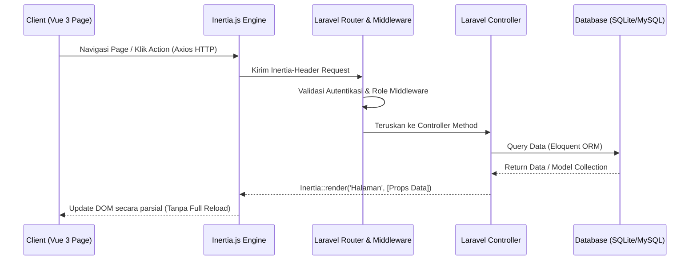
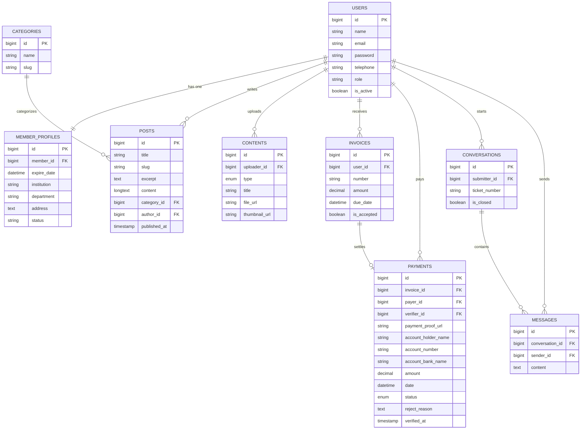
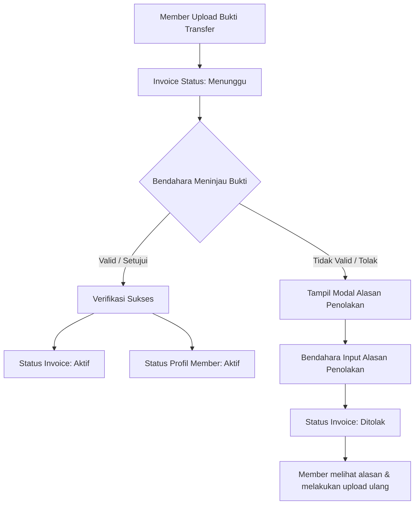

# 📘 Dokumentasi Resmi Proyek: Aplikasi Member Komunitas (AMK)
> **Nama Sandi Proyek:** PBL WOY / Aplikasi Member Komunitas  
> **Karakteristik Aplikasi:** Single Page Application (SPA) berbasis Peran (RBAC) dengan Responsivitas Visual Tinggi  
> **Teknologi Utama:** Laravel 11.x, Vue 3 (Composition API), Inertia.js, Tailwind CSS

---

## 🧭 1. Gambaran Umum Proyek
**Aplikasi Member Komunitas (AMK)** adalah platform manajemen terpadu yang dirancang khusus untuk memfasilitasi kebutuhan keanggotaan komunitas digital modern. Sistem ini menjembatani interaksi antara anggota biasa (*Member*) dengan pengurus (*Super Admin*, *Ketua*, *Petugas*, dan *Bendahara*).

### Fitur Utama:
- **E-Learning & Content Delivery:** Menyediakan akses eksklusif untuk materi edukatif berupa **Video Pembelajaran** dan **E-Book** dengan pembagian hak akses premium.
- **Sistem Keanggotaan Premium:** Alur registrasi keanggotaan berbayar terintegrasi dengan invoice otomatis dan verifikasi bukti pembayaran manual.
- **Forum Q&A (Tanya Jawab):** Sistem tiket forum yang menghubungkan member langsung dengan staf/petugas untuk berkonsultasi secara interaktif.
- **Community Blog/News:** Portal publikasi artikel dan kegiatan resmi komunitas dengan editor teks kaya (*Rich Text Editor*).
- **Statistik & Visualisasi:** Grafik interaktif bagi pengurus (Ketua) untuk memantau tren pendaftaran, konten, dan status keuangan.

---

## 🏗️ 2. Arsitektur & Aliran Sistem (Inertia.js SPA)
Aplikasi ini dibangun menggunakan arsitektur **Modern Monolith** menggunakan **Inertia.js**. Keunggulan arsitektur ini adalah mempertahankan kecepatan pengembangan Laravel dibarengi dengan pengalaman pengguna interaktif ala *Single Page Application (SPA)* menggunakan Vue 3 tanpa overhead pembuatan API terpisah.

### Aliran Data Request-Response:


---

## 👥 3. Peta Kontrol Akses Berbasis Peran (RBAC)
Sistem memiliki 5 peran pengguna (*Roles*) yang terdefinisi dengan sangat ketat. Setiap akses ke menu atau aksi dilindungi oleh middleware `role:nama_role`.

| Peran (Role) | Kode Sistem | Deskripsi Tanggung Jawab Utama | Halaman Utama / Fitur Utama |
| :--- | :--- | :--- | :--- |
| **Super Admin** | `super_admin` | Mengontrol konfigurasi sistem dan manajemen akun seluruh pengurus. | Kelola Akun Pengurus, Aktivasi/Deaktivasi User, Pengaturan Profil & Web. |
| **Ketua (Leader)** | `leader` / `ketua` | Memantau seluruh aktivitas komunitas secara makro melalui laporan grafis. | Dashboard Statistik Keuangan & Anggota, Visualisasi Chart.js, Detail Statistik. |
| **Petugas (Staff)** | `staff` | Mengelola materi edukasi, menulis artikel blog, dan menjawab pertanyaan member. | Upload Video & Ebook, Manajemen Blog (Quill Editor), Forum Balas Tiket Pertanyaan. |
| **Bendahara** | `bendahara` | Mengurusi verifikasi administrasi pembayaran keanggotaan berbayar. | Daftar Invoice, Verifikasi Pembayaran, Sistem Penolakan Pembayaran (+Alasan). |
| **Member** | `member` | Pengguna akhir komunitas yang menikmati materi, blog, dan mengajukan konsultasi. | Landing Page, Billing & Pembayaran Premium, Akses Konten (Video/Ebook), Forum Q&A. |

---

## 🗄️ 4. Struktur Database & Model Relasional
Database default menggunakan **SQLite** untuk kelancaran fase pengembangan, namun dirancang kompatibel untuk migrasi ke **MySQL/PostgreSQL**.

### Diagram Relasi Entitas Utama (ERD):


---

## 📁 5. Folder & Berkas Penting
Struktur proyek mengikuti konvensi Laravel 11 dengan integrasi aset modern:

- 📂 **`app/Http/Controllers/`**
  - 📁 `Admin/`: Controller untuk manajemen data sistem oleh Super Admin (`KelolAkunController.php`, `PengaturanController.php`, `SuperAdminProfilController.php`).
  - 📁 `Ketua/`: Laporan visual dan statistik umum (`StatistikController.php`, `DetailController.php`).
  - 📁 `Petugas/`: Penanganan konten, artikel, dan forum tanya jawab (`KontenController.php`, `BlogController.php`, `PertanyaanController.php`).
  - 📁 `Bendahara/`: Manajemen persetujuan administrasi pembayaran (`PembayaranController.php`).
- 📂 **`app/Http/Middleware/`**
  - 📄 `CheckRole.php`: Middleware penapis hak akses rute. Mengubah parameter `'ketua'` menjadi role `'leader'` secara dinamis di database.
- 📂 **`resources/js/Pages/`**
  - Halaman Vue terorganisasi rapi berdasarkan folder role masing-masing: `Admin/`, `Ketua/`, `Petugas/`, `Bendahara/`, `Profile/`, `Blog/`.
- 📂 **`resources/js/Layouts/`**
  - Layout dinamis yang membungkus komponen navigasi unik untuk masing-masing role: `AdminLayout.vue`, `KetuaLayout.vue`, `PetugasLayout.vue`, `BendaharaLayout.vue`, dan `AppLayout.vue` (untuk Landing Page & Member).
- 📂 **`routes/web.php`**
  - Berkas konfigurasi rute terpusat yang memetakan URL ke Controller dengan proteksi middleware `auth` dan `role:X`.

---

## 🛣️ 6. Sistem Routing & Middleware
Routing utama diatur menggunakan larik middleware demi memastikan keamanan data:

```php
// Contoh Rute Petugas
Route::middleware(['auth', 'verified', 'role:staff'])
    ->prefix('petugas')
    ->name('petugas.')
    ->group(function () {
        Route::get('/konten', [KontenController::class, 'index'])->name('konten.index');
        Route::post('/konten', [KontenController::class, 'store'])->name('konten.store');
        // ... rute lainnya
    });
```
Setiap rute yang berawalan `/petugas/*` hanya dapat diakses oleh user dengan `role == 'staff'`. Jika role tidak sesuai, sistem akan merespon dengan status **HTTP 403 Forbidden**.

---

## 💻 7. Panduan Instalasi & Setup Lokal (Development)

Ikuti langkah-langkah berikut untuk menjalankan aplikasi di lingkungan lokal Anda:

### ⚙️ Prasyarat:
- **PHP** versi `^8.2` atau `^8.3`
- **Node.js** versi `^18.x` atau `^20.x`
- **Composer** versi `^2.x`

### 🛠️ Langkah-Langkah:
1. **Clone Proyek & Masuk Direktori:**
   ```bash
   cd aplikasi-member-komunitas
   ```
2. **Instalasi Dependensi Backend (PHP):**
   ```bash
   composer install
   ```
3. **Instalasi Dependensi Frontend (Node):**
   ```bash
   npm install
   ```
4. **Konfigurasi Environment:**
   Salin file `.env.example` ke `.env`
   ```bash
   cp .env.example .env
   ```
5. **Generate Kunci Enkripsi Aplikasi:**
   ```bash
   php artisan key:generate
   ```
6. **Inisialisasi Database (SQLite):**
   Pastikan file database SQLite kosong telah dibuat jika menggunakan SQLite.
   ```bash
   touch database/database.sqlite
   ```
   Jalankan migrasi database beserta data seeding awal (akun pengujian):
   ```bash
   php artisan migrate --seed
   ```
7. **Jalankan Server Lokal:**
   Buka dua jendela terminal terpisah dan jalankan:
   - **Terminal 1 (Backend Server):**
     ```bash
     php artisan serve
     ```
   - **Terminal 2 (Frontend Hot Reload Vite):**
     ```bash
     npm run dev
     ```
8. **Akses Aplikasi:**
   Buka browser dan buka alamat `http://127.0.0.1:8000`

---

## 🔐 8. Kredensial Akun Pengujian Default (Seeders)
Untuk memudahkan peninjauan fitur di lingkungan lokal, database seeder telah menyediakan beberapa akun contoh untuk setiap peran:

> [!IMPORTANT]
> Sandi (*password*) untuk seluruh akun di bawah ini adalah: **`password`**

* **Super Admin:**  
  📧 Email: `superadmin@amk.com`  
  👑 Nama: Met Slamet  
* **Ketua (Leader):**  
  📧 Email: `ketua@amk.com`  
  📊 Nama: Jo Bejo  
* **Petugas (Staff):**  
  📧 Email: `staff@amk.com`  
  📝 Nama: Agus Haryanto  
* **Bendahara:**  
  📧 Email: `bendahara@amk.com`  
  💳 Nama: Jo Paijo  
* **Anggota Biasa (Member):**  
  📧 Email: `nem@amk.com` / `siti@amk.com` / `budi@amk.com`  
  👤 Nama: Nem Painem / Siti Rahayu / Budi Santoso  

---

## 🎨 9. Analisis Fitur Unggulan & Standarisasi UI

### A. Alur Verifikasi & Penolakan Bukti Pembayaran (Bendahara)
Sistem memiliki mekanisme keamanan saat Bendahara melakukan peninjauan pembayaran.

Sistem ini diimplementasikan menggunakan dialog modal interaktif di `resources/js/Pages/Bendahara/Pembayaran/Show.vue` yang terhindar dari penyalahgunaan aksi tanpa alasan penolakan yang jelas.

### B. Editor Kaya (WYSIWYG Quill)
Di halaman penulisan artikel dan konten oleh Petugas, sistem mengintegrasikan komponen **Vue Quill Editor** (`@vueup/vue-quill`). Komponen ini dibungkus secara kustom agar menghasilkan tag HTML yang bersih sehingga mempermudah proses rendering artikel di halaman publik blog tanpa merusak estetika antarmuka.

### C. Visualisasi Data Dinamis (Chart.js)
Pada halaman dashboard Ketua, grafik batang (*Bar Chart*) dan lingkaran (*Doughnut Chart*) menggunakan `vue-chartjs` dipadukan secara dinamis untuk menggambarkan peningkatan jumlah keanggotaan aktif serta grafik statistik bulanan pemasukan kas komunitas.

### D. Konsistensi Transparansi Navbar
Aplikasi menggunakan sistem navigasi global (`AppLayout.vue`) dengan transisi warna latar belakang navbar yang cerdas. Pada halaman landing (*Home*), navbar akan tetap transparan sewaktu di posisi atas halaman (*scroll position 0*) dan berangsur menjadi berlatar solid dengan efek blur kaca halus (*glassmorphism*) saat digulir ke bawah, memberikan sentuhan premium sejak impresi pertama.

### E. Sistem Percakapan Real-Time Berbasis Cache (Redis to SQL Database)
Untuk mendukung interaksi langsung antara member dan petugas tanpa membebani disk database, sistem chat real-time diimplementasikan menggunakan pola **Cache-First Verify-and-Write** dengan memprioritaskan Redis sebagai RAM cache berkecepatan tinggi sebelum diteruskan ke database SQL.
*   **Struktur File Implementasi:**
    *   `app/Services/ChatService.php`: Layanan enkapsulasi perintah Redis (inisialisasi sesi hash meta, push pesan list `'chat:session:{session_id}'`, update TTL, validasi status sesi).
    *   `app/Http/Middleware/ValidateChatSession.php`: Middleware penapis hak kirim pesan pada sesi chat aktif di Redis (`chat.active`).
    *   `app/Events/ChatMessageSent.php`: Event broadcast WebSocket untuk pembaruan UI instan pada lawan bicara.
    *   `app/Http/Controllers/ChatController.php`: Endpoint controller untuk memulai sesi, bergabung, mengirim pesan (dengan verifikasi cache-first), dan mengakhiri chat.
*   **Keamanan & Aliran Data:** Setiap pesan dikirim wajib masuk dan di-cache terlebih dahulu ke Redis. Setelah diverifikasi keberadaannya di cache Redis, baru disimpan secara permanen ke database SQL (`conversations` dan `messages` tables). Saat sesi ditutup, cache memori Redis dibersihkan seketika.

### F. Standarisasi Komponen UI & Paginasi Kustom
Untuk memastikan konsistensi pengalaman pengguna sesuai dengan desain *mockup* asli, aplikasi menerapkan komponen paginasi kustom yang menyertakan tombol navigasi "Sebelumnya" dan "Berikutnya" dipadukan dengan deretan angka halaman (*numeric page selectors*). Selain itu, sistem *grid layout* responsif dinamis diimplementasikan pada berbagai halaman, contohnya *grid* 3-kolom untuk daftar Video dan *grid* 5-kolom untuk daftar E-book, guna memberikan tampilan visual yang rapi dan terstruktur di dashboard Petugas dan Member.

---

## 🚀 10. Rekomendasi Skalabilitas & Panduan Produksi

1. **Migrasi Engine Database:**  
   Pada lingkungan produksi (*Production*), sangat dianjurkan untuk beralih dari **SQLite** ke **MySQL** atau **PostgreSQL** guna mencegah masalah penguncian tabel (*database locking*) akibat transaksi bersamaan sewaktu banyak pengguna mengunggah bukti pembayaran secara serentak.
2. **Setup Driver Storage:**  
   Pastikan konfigurasi `FILESYSTEM_DISK` diatur ke driver penyimpanan publik, dan jalankan perintah:
   ```bash
   php artisan storage:link
   ```
   Hal ini mutlak diperlukan agar bukti pembayaran dan avatar pengguna dapat diakses secara publik dan aman oleh server web.
3. **Kompilasi Aset Produksi:**  
   Selalu jalankan proses kompilasi bundel production sebelum melakukan deploy:
   ```bash
   npm run build
   ```
4. **Optimasi Cache Laravel:**  
   Jalankan serangkaian perintah optimasi berikut saat men-deploy versi terbaru aplikasi ke server VPS:
   ```bash
   php artisan config:cache
   ```
   ```bash
   php artisan route:cache
   ```
   ```bash
   php artisan view:cache
   ```

---

*Hak Cipta © 2026. Tim Pengembang PBL WOY - Aplikasi Member Komunitas.*
