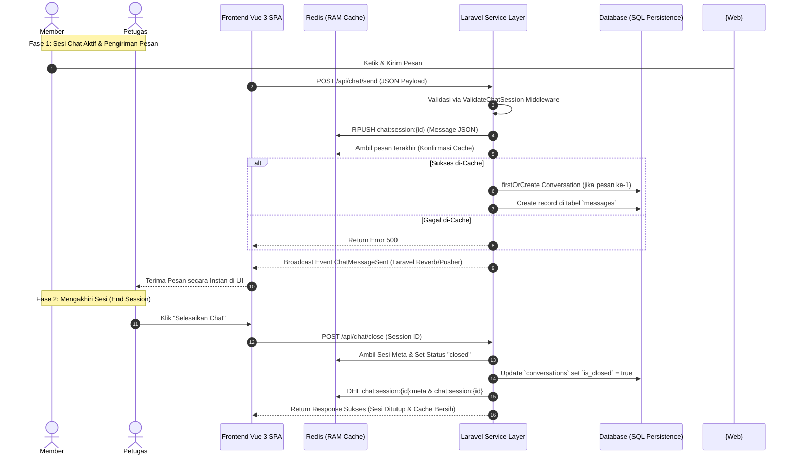

# 💬 Arsitektur & Logika Sistem Chat Real-Time (Redis Cache to SQL Database)

Dokumen ini menjelaskan rancangan arsitektur, pemetaan cache, dan implementasi kode lengkap untuk sistem percakapan (*chat*) real-time di Laravel.

Sistem ini dirancang menggunakan pola **Write-Through Cache (Cache-First Verify-and-Write)**: setiap kali pesan dikirim (baik oleh member maupun petugas), pesan tersebut tidak langsung dimasukkan ke database SQL. Pesan wajib disimpan dan di-cache terlebih dahulu di **Redis** menggunakan kunci unik `chat:session:{session_id}`. Setelah diverifikasi sukses masuk cache Redis, barulah pesan dilanjutkan untuk disimpan secara permanen di database SQL secara real-time.

---

## 📐 1. Aliran Arsitektur & Workflow Sistem

Berikut adalah visualisasi alur pengiriman pesan dan proses sinkronisasi database:



---

## 🗄️ 2. Struktur Penyimpanan Cache Redis (Desain Efisien)

Untuk efisiensi penyimpanan memori di Redis, kita menggunakan dua tipe struktur data:
1.  **Redis Hash (untuk Metadata Sesi):**  
    Digunakan untuk menyimpan status sesi chat, ID partisipan, dan waktu mulai.
    *   **Key:** `chat:session:{session_id}:meta`
    *   **Fields:**
        *   `member_id`: ID pengguna member.
        *   `staff_id`: ID petugas/staf yang melayani.
        *   `status`: Status sesi (`active` / `closed`).
        *   `created_at`: Timestamp mulai chat.

2.  **Redis List (untuk Antrean Pesan):**  
    Digunakan untuk menampung seluruh pesan secara kronologis. Operasi `RPUSH` menjamin penulisan seharga $O(1)$ dan `LRANGE` menjamin pembacaan seharga $O(N)$.
    *   **Key:** `chat:session:{session_id}`
    *   **Payload Data (JSON String):**
        ```json
        {
          "sender_id": 1,
          "sender_role": "member",
          "content": "Halo, saya butuh bantuan mengenai pembayaran...",
          "timestamp": "2026-05-19T02:28:30.000000Z"
        }
        ```

---

## 🗂️ 3. Skema Database (SQL Fallback / Persistence)

Saat sesi ditutup, data telah tersimpan secara bertahap di tabel relational berikut di database SQL:

### A. Tabel `conversations` (Sesi Percakapan)
```php
Schema::create('conversations', function (Blueprint $table) {
    $table->id();
    $table->string('ticket_number')->unique(); // ID unik sesi Redis (TKT-CH-*)
    $table->foreignId('submitter_id')->constrained('users')->cascadeOnDelete();
    $table->boolean('is_closed')->default(false);
    $table->timestamps();
});
```

### B. Tabel `messages` (Isi Chat Percakapan)
```php
Schema::create('messages', function (Blueprint $table) {
    $table->id();
    $table->foreignId('conversation_id')->constrained()->cascadeOnDelete();
    $table->foreignId('sender_id')->constrained('users')->cascadeOnDelete();
    $table->text('content');
    $table->timestamps();
});
```

---

## 🛠️ 4. Detail Implementasi Laravel 11

Berikut adalah kode sumber lengkap yang diimplementasikan dengan membagi tanggung jawab ke dalam berbagai layer arsitektur:

### A. Service Layer (`App\Services\ChatService.php`)
Layer ini merangkum seluruh fungsionalitas interaksi dengan Redis Cache.

```php
<?php

namespace App\Services;

use Illuminate\Support\Facades\Redis;
use Illuminate\Support\Str;

class ChatService
{
    private $sessionTtl = 86400; // TTL Sesi Chat: 24 Jam (dalam detik)

    /**
     * Membuat sesi chat baru di Redis.
     */
    public function createSession(int $memberId): string
    {
        // Menghasilkan ticket number unik seperti format Q&A
        $sessionId = 'TKT-CH-' . strtoupper(Str::random(8));

        $metaKey = "chat:session:{$sessionId}:meta";
        Redis::hmset($metaKey, [
            'member_id' => $memberId,
            'staff_id' => '', // Kosong sampai diambil oleh petugas
            'status' => 'active',
            'created_at' => now()->toIso8601String()
        ]);

        Redis::expire($metaKey, $this->sessionTtl);

        return $sessionId;
    }

    /**
     * Menghubungkan petugas ke sesi chat.
     */
    public function assignStaff(string $sessionId, int $staffId): bool
    {
        $metaKey = "chat:session:{$sessionId}:meta";
        if (!Redis::exists($metaKey)) return false;

        Redis::hset($metaKey, 'staff_id', $staffId);
        return true;
    }

    /**
     * Mengirim pesan baru ke dalam list Redis dengan key 'chat:session:{session_id}'
     */
    public function pushMessage(string $sessionId, int $senderId, string $senderRole, string $content): array
    {
        $messagesKey = "chat:session:{$sessionId}";
        $metaKey = "chat:session:{$sessionId}:meta";

        $messagePayload = [
            'sender_id' => $senderId,
            'sender_role' => $senderRole,
            'content' => e($content), // Proteksi XSS
            'timestamp' => now()->toIso8601String()
        ];

        // RPUSH menambah pesan di akhir list
        Redis::rpush($messagesKey, json_encode($messagePayload));

        // Refresh TTL agar sesi tidak kedaluwarsa sewaktu aktif mengobrol
        Redis::expire($messagesKey, $this->sessionTtl);
        Redis::expire($metaKey, $this->sessionTtl);

        return $messagePayload;
    }

    /**
     * Mengambil daftar pesan dari Redis.
     */
    public function getSessionMessages(string $sessionId): array
    {
        $messagesKey = "chat:session:{$sessionId}";
        $rawMessages = Redis::lrange($messagesKey, 0, -1);

        return array_map(function ($msg) {
            return json_decode($msg, true);
        }, $rawMessages);
    }

    /**
     * Memeriksa apakah sesi masih aktif.
     */
    public function isSessionActive(string $sessionId): bool
    {
        $metaKey = "chat:session:{$sessionId}:meta";
        if (!Redis::exists($metaKey)) return false;
        
        $status = Redis::hget($metaKey, 'status');
        return $status === 'active';
    }

    /**
     * Mengubah status sesi di Redis menjadi closed.
     */
    public function closeSession(string $sessionId): bool
    {
        $metaKey = "chat:session:{$sessionId}:meta";
        if (!Redis::exists($metaKey)) return false;

        Redis::hset($metaKey, 'status', 'closed');
        return true;
    }

    /**
     * Mengambil member_id dari metadata sesi Redis.
     */
    public function getMemberIdFromMeta(string $sessionId): int
    {
        $metaKey = "chat:session:{$sessionId}:meta";
        return (int) Redis::hget($metaKey, 'member_id');
    }

    /**
     * Menghapus cache setelah disinkronkan ke DB.
     */
    public function clearSessionCache(string $sessionId): void
    {
        Redis::del("chat:session:{$sessionId}:meta");
        Redis::del("chat:session:{$sessionId}");
    }
}
```

---

### B. Middleware Validasi Sesi Chat (`App\Http\Middleware\ValidateChatSession.php`)
Middleware ini menjamin pengguna hanya bisa mengirim pesan pada sesi yang terdaftar dan sedang berstatus `active`.

```php
<?php

namespace App\Http\Middleware;

use App\Services\ChatService;
use Closure;
use Illuminate\Http\Request;
use Symfony\Component\HttpFoundation\Response;

class ValidateChatSession
{
    protected $chatService;

    public function __construct(ChatService $chatService)
    {
        $this->chatService = $chatService;
    }

    public function handle(Request $request, Closure $next): Response
    {
        $sessionId = $request->input('session_id') ?? $request->route('session_id');

        if (!$sessionId || !$this->chatService->isSessionActive($sessionId)) {
            return response()->json([
                'status' => 'error',
                'message' => 'Sesi chat tidak valid, sudah ditutup, atau kedaluwarsa.'
            ], Response::HTTP_FORBIDDEN);
        }

        return $next($request);
    }
}
```

Daftarkan middleware ini di `bootstrap/app.php` dengan alias:
```php
$middleware->alias([
    'chat.active' => \App\Http\Middleware\ValidateChatSession::class,
]);
```

---

### C. Real-Time Broadcast Event (`App\Events\ChatMessageSent.php`)
Event ini disiarkan melalui WebSocket (Laravel Reverb / Pusher) untuk update antarmuka secara instan pada sisi lawan mengobrol.

```php
<?php

namespace App\Events;

use Illuminate\Broadcasting\Channel;
use Illuminate\Broadcasting\InteractsWithSockets;
use Illuminate\Broadcasting\PresenceChannel;
use Illuminate\Broadcasting\PrivateChannel;
use Illuminate\Contracts\Broadcasting\ShouldBroadcast;
use Illuminate\Foundation\Events\Dispatchable;
use Illuminate\Queue\SerializesModels;

class ChatMessageSent implements ShouldBroadcast
{
    use Dispatchable, InteractsWithSockets, SerializesModels;

    public $sessionId;
    public $message;

    public function __construct(string $sessionId, array $message)
    {
        $this->sessionId = $sessionId;
        $this->message = $message;
    }

    public function broadcastOn(): array
    {
        // Channel privat unik untuk sesi chat ini saja
        return [
            new PrivateChannel("chat.session.{$this->sessionId}")
        ];
    }

    public function broadcastAs(): string
    {
        return 'message.sent';
    }
}
```

---

### D. Controller Utama (`App\Http\Controllers\ChatController.php`)
Menghubungkan Request API dari pengguna dengan Service Layer dan Event Broadcast.

```php
<?php

namespace App\Http\Controllers;

use App\Events\ChatMessageSent;
use App\Services\ChatService;
use Illuminate\Http\Request;
use Illuminate\Http\JsonResponse;

class ChatController extends Controller
{
    protected $chatService;

    public function __construct(ChatService $chatService)
    {
        $this->chatService = $chatService;
    }

    /**
     * Memulai sesi chat baru (Dipanggil oleh Member)
     */
    public function startChat(Request $request): JsonResponse
    {
        $memberId = $request->user()->id;
        $sessionId = $this->chatService->createSession($memberId);

        return response()->json([
            'status' => 'success',
            'session_id' => $sessionId,
            'message' => 'Sesi chat berhasil diinisialisasi.'
        ]);
    }

    /**
     * Petugas mengambil/melayani sesi chat yang masuk
     */
    public function joinChat(Request $request, string $sessionId): JsonResponse
    {
        $staffId = $request->user()->id;
        $success = $this->chatService->assignStaff($sessionId, $staffId);

        if (!$success) {
            return response()->json([
                'status' => 'error',
                'message' => 'Sesi chat tidak valid atau telah berakhir.'
            ], 404);
        }

        return response()->json([
            'status' => 'success',
            'message' => 'Anda telah bergabung ke sesi chat ini.'
        ]);
    }

    /**
     * Mengirim pesan dalam sesi chat (Diproteksi Middleware 'chat.active')
     * Pola: Simpan ke Redis -> Cek Validitas di Cache -> Simpan Database SQL
     */
    public function sendMessage(Request $request, string $sessionId): JsonResponse
    {
        $request->validate([
            'content' => 'required|string|max:1000'
        ]);

        $user = $request->user();
        
        // 1. Simpan pesan ke Redis terlebih dahulu dengan key 'chat:session:{session_id}'
        $messageData = $this->chatService->pushMessage(
            $sessionId,
            $user->id,
            $user->role, // 'member' atau 'staff'
            $request->content
        );

        // 2. Sebelum lanjut ke database, pastikan pesan sudah tersimpan di cache Redis (Cek di Cache)
        $cachedMessages = $this->chatService->getSessionMessages($sessionId);
        $latestCached = end($cachedMessages);

        if ($latestCached && $latestCached['timestamp'] === $messageData['timestamp']) {
            // Sukses di-cache! Baru lanjut simpan ke database SQL.
            $memberId = $this->chatService->getMemberIdFromMeta($sessionId);

            // Cari atau buat master percakapan di database (ticket_number = sessionId)
            $conversation = \App\Models\Conversation::firstOrCreate(
                ['ticket_number' => $sessionId],
                [
                    'submitter_id' => $memberId ?: $user->id,
                    'is_closed'    => false,
                ]
            );

            // Simpan detail pesan ke database SQL
            \App\Models\Message::create([
                'conversation_id' => $conversation->id,
                'sender_id'       => $latestCached['sender_id'],
                'content'         => $latestCached['content'],
                'created_at'      => $latestCached['timestamp'],
                'updated_at'      => now(),
            ]);
        }

        // Siarkan secara real-time via WebSocket
        broadcast(new ChatMessageSent($sessionId, $messageData))->toOthers();

        return response()->json([
            'status' => 'success',
            'data' => $messageData
        ]);
    }

    /**
     * Mengakhiri sesi chat oleh siapa pun (Member/Staf) dan membersihkan cache
     */
    public function closeChat(Request $request, string $sessionId): JsonResponse
    {
        // 1. Set status closed di cache agar tidak menerima pesan baru lagi
        $closed = $this->chatService->closeSession($sessionId);

        if (!$closed) {
            return response()->json([
                'status' => 'error',
                'message' => 'Sesi tidak dapat ditutup karena tidak ditemukan.'
            ], 400);
        }

        // 2. Set status percakapan di database SQL menjadi closed/selesai
        \App\Models\Conversation::where('ticket_number', $sessionId)->update([
            'is_closed' => true
        ]);

        // 3. Bersihkan memori cache Redis karena sesi telah berakhir
        $this->chatService->clearSessionCache($sessionId);

        return response()->json([
            'status' => 'success',
            'message' => 'Sesi chat ditutup dan dibersihkan dari cache.'
        ]);
    }
}
```

---

### E. Pemetaan API Rute (`routes/api.php` / `routes/web.php`)
```php
use App\Http\Controllers\ChatController;

Route::middleware(['auth'])->prefix('chat')->group(function () {
    // Aksi Inisialisasi
    Route::post('/start', [ChatController::class, 'startChat'])->name('chat.start');
    Route::post('/join/{session_id}', [ChatController::class, 'joinChat'])->name('chat.join');
    Route::post('/close/{session_id}', [ChatController::class, 'closeChat'])->name('chat.close');

    // Aksi Pengiriman Pesan (Dilindungi Middleware Validasi Keaktifan Sesi)
    Route::middleware(['chat.active'])->group(function () {
        Route::post('/send/{session_id}', [ChatController::class, 'sendMessage'])->name('chat.send');
    });
});
```
